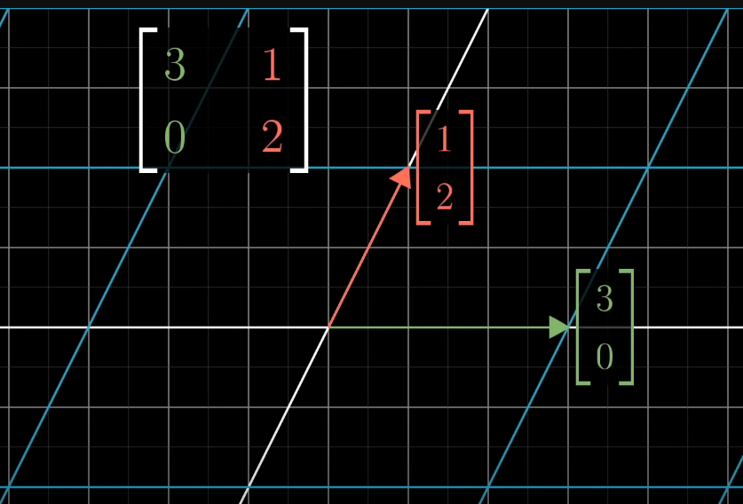

```
---
Name: Kwondo Ma
Topic: [12]
Title: Why do we learn eigenvalue problem in math class?
----
```

# Eigenvalue Problem

The eigenvalue problem is determination of non-trivial solutions of $$Ax = λx$$ for vector $x$ and scalar value $λ$ [1]. Here, the matrix $A$ has to be a square matrix, vector $x$ can not be a zero vector, and scalar $λ$ has to be a real number. The solution vector $x$ is defined as an eigenvector and the corresponding scalar value $λ$ is defined as an eigenvalue.

Let's look into how to solve this eigenvalue problem. Assume that the matrix $A$ is $n \times n$ matrix. Then, the equation can be written as $(A-λI)x = 0$ where $I$ is represented an identity matrix with a size of $n \times n$. For deriving non-trivial solutions, determinant of $A-λI$ part has to be zero as, $det(A-λI)=0$. As long as we have full knowledge of matrix $A$, this is an equation with one unknown variable $λ$ and the order of this equation $n$. Therefore, we can compute the values of $λ$ from this equation (sometimes some of them are not real numbers and in this case, we dont have eigenvalue-eigenvector pairs).

Once we compute the $n$ number of eigenvalues $λ$, we can derive the corresponding eigenvector $x$ by substituting $λ$ into equation $(A-λI)x = 0$. Here, eigenvector $x$ has $n$ unknown variable and we have $n$ number of equation out of initial equation $(A-λI)x = 0$. Therefore, we can specify each eigenvector $x$ from corresponding eigenvalue $λ$.

In conclusion, equation $Ax = λx$ is solved by computing a determinant of matrix $A-λI$ for eigenvalues first, and then derive the corresponding eigenvectors later.

## What are these (eigenvalue, eigenvector) pairs used for?

Multiplication of matrix $A$ is a linear transformation. These are the examples of $2 \times 2$ matrix. 

        [ 3  0 ]              [ -1  0 ]           [ 0   1]  
    A = [ 0  0.5]        B =  [ 0  -2]        C = [ -1  0]  

For a case of matrix $A$, base of x-axis is stretched by 3 times and base of y-axis is compressed by half. For other examples, the directions of axes can be flipped (for example matrix $B$) or rotated (for example matrix $C$). Let's think about how eigenvector behave under this linear transformation. The linear transformation of vector $Ax$ is identical with a term of $λx$ which is a scalar multiplication of vector $x$. This represents two things: (1) the direction of eigenvector $x$ is preserved under the linear transformation, and (2) the amount of scalar change due to the linear transformation is represented by $λ$.

## Visualization of eigenvalue problem
Here, $A$ is defined as $2 \times 2$ matrix and the figure shows the linear transformation.
   



## Practical applications using eigenvalue problem


# Reference

[1] Wilkinson, James Hardy. The algebraic eigenvalue problem, volume 662. Oxford Clarendon, 1965.
